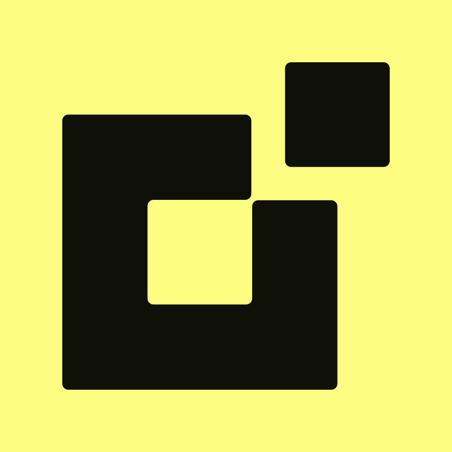
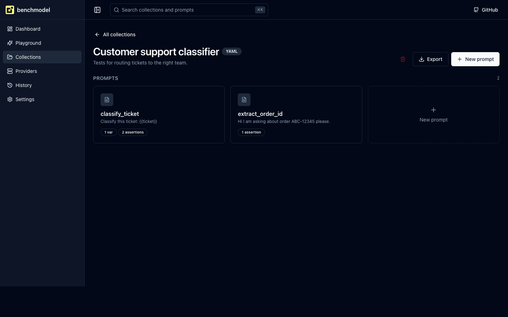

<p align="center">
  
</p>

<h1 align="center">benchmodel</h1>

<p align="center">
  <strong>Test, version, and ship prompts for any open source LLM. Runs locally.</strong>
</p>

<p align="center">
  <a href="LICENSE"></a>
  <a href="#"></a>
  <a href="#"></a>
</p>

## Why Benchmodel

- **Local first.** Connects to anything that speaks the OpenAI chat API or the native Ollama API. Models, prompts, and runs stay on your machine.
- **Versionable prompts.** Collections live as YAML or JSON files. Commit them to Git, review them in pull requests, diff them like code.
- **Prompts as HTTP endpoints.** Pin a default provider and model on a prompt, and call it from anywhere with `POST /api/prompts/<id>/invoke`. Body in, `{ "output": "..." }` out.

## Screenshot




## Quick start

### Docker

```bash
docker compose up
# open http://localhost:3737
```

### npm

```bash
npx benchmodel
# data is stored in ~/.benchmodel/data.db
# open http://localhost:3737
```

### Local development

```bash
pnpm install
pnpm dev
# open http://localhost:3737
```

## Collection schema

Collections are plain YAML or JSON files. Both formats share the same shape and are validated with Zod on import.

```yaml
name: "Customer support classifier"           # required, free text
description: "Tests for routing tickets"      # optional
prompts:                                      # required, at least one entry
  - name: "classify_ticket"                   # required, used in the UI
    system: "You are a classifier..."         # optional, system message
    user: "Classify this ticket: {{ticket}}"  # required, supports {{variables}}
    variables:                                # optional, default values
      ticket: "My order is late"
    assertions:                               # optional, run on every output
      - type: contains
        value: "shipping"
      - type: regex
        pattern: "ABC-\\d+"
        flags: "i"
      - type: json_schema
        schema:
          type: object
          properties:
            category: { type: string }
            priority: { type: string }
```

Three assertion types are supported in MVP: `contains`, `regex`, and `json_schema` (validated with Ajv).

See full examples in [examples/collection.example.yaml](examples/collection.example.yaml) and [examples/collection.example.json](examples/collection.example.json).

## Calling a prompt as an API

Set the default provider and model on the prompt (in the editor, Binding section), save, then call it.

```bash
curl -X POST http://localhost:3737/api/prompts/<id>/invoke \
  -H 'content-type: application/json' \
  -d '{"variables": {"ticket": "My order is late"}}'
```

Response:

```json
{ "output": "{\"category\":\"shipping\",\"priority\":\"high\"}" }
```

The endpoint is open by design (local first). Variables in the request body override the defaults stored on the prompt.

## How it compares

| Tool | Local first | Versionable prompts | Streaming Playground | Open source |
|---|---|---|---|---|
| Benchmodel | yes | yes (YAML or JSON in Git) | yes | yes (MIT) |
| Open WebUI | yes | partial | yes | yes |
| Promptfoo | yes | yes (CLI focused) | no | yes |
| OpenRouter | no (cloud) | no | yes | no |
| LM Studio | yes | no | yes | no (proprietary) |

## Roadmap

**MVP (current)**
- Native and OpenAI compatible providers (Ollama, vLLM, llama.cpp, LM Studio, Together, Groq, and more)
- Collections in YAML and JSON
- Variables and three assertion types
- Streaming Playground with stop and save as prompt
- Per prompt HTTP invoke endpoint
- Run history with model, status, and time range filters
- Hover quick run on prompt cards
- Dashboard with real CPU and memory info

**v2**
- LLM as judge assertions
- Function calling and tool use
- Multi user with roles
- OpenTelemetry tracing for runs
- Embedded Git sync for collections
- Eval suites (run a whole collection at once)

## Contributing

We love contributions. See [CONTRIBUTING.md](CONTRIBUTING.md) for setup, conventions, and the PR checklist.

Look for issues labeled `good first issue` or `help wanted` to get started.

## License

[MIT](LICENSE)
